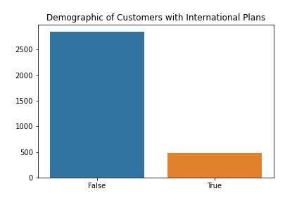
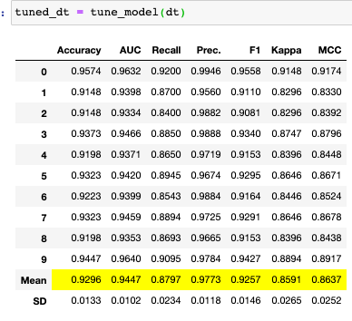

# Churn within Telecom

### The stakeholder, SyriaTel, is a telecommunications company whose goal is to better understand what may be causing customer churn. The data set represents an ea of telecom where the business model was non subscription based, a pay-as-you-go business model. Due to limits on data size, the model will only be robust enough to be used by SyriaTel to analyze their specific data provided. Further this is a piliminary proprosal for our business intelligence team to take steps in better enhancing the customer expereince. As we recognize with an older dataset there may be limitation. However, we are positive we can look into the past to learn what to do and what works for this iteration of our customer churn classification model

## The Data
### The  data was provided via kaggle and focuses on SyriaTel's customer churn. Below you will find a refrence list regarding the data set.
### The data used was provided by SyriaTel at this address: https://www.kaggle.com/becksddf/churn-in-telecoms-dataset

* state: string. 2-letter code of the US state of customer residence
* account_length: numerical. Number of months the customer has been with the current telco provide
* area_code: string="area_code_AAA" where AAA = 3 digit area code.
* international_plan: (yes/no). The customer has international plan.
* voice_mail_plan: (yes/no). The customer has voice mail plan.
* number_vmail_messages: numerical. Number of voice-mail messages.
* total_day_minutes: numerical. Total minutes of day calls.
* total_day_calls: numerical. Total number of day calls.
* total_day_charg: numerical. Total charge of day calls.
* total_eve_minutes: numerical. Total minutes of evening calls.
* total_eve_calls: numerical. Total number of evening calls.
* total_eve_charge: numerical. Total charge of evening calls.
* total_night_minutes: numerical. Total minutes of night calls.
* total_night_calls: numerical. Total number of night calls.
* total_night_charge: numerical. Total charge of night calls.
* total_intl_minutes: numerical. Total minutes of international calls.
* total_intl_calls: numerical. Total number of international calls.
* total_intl_charge: numerical. Total charge of international calls
* number_customer_service_calls: numerical. Number of calls to customer service

## Target
* churn: (yes/no) Customer churn - target variable.
* Almost 15% of customer have churned.

## The Problem Statement
1) Classsification: Can we classify or predict customer who will churn?
2) Identification: Can we identify reason(s) for customer Churn?
3) Retention: What effective measures can we use to reatin customers?

## Method
1) Model Testing
 * Logistic Regression
 * Decision Tree
 * Random Forest
2) Model Tuning
  * Logistic Regression with GridSearch CV
  * Decision Tree with GridSearch CV
3) Py Caret

## Recommendations
1) Customer Service: The company needs to potentially focus its efforts in reducing customer service calls.
2) Sales: Focus on increase sales of international plans and consider the subscription based business model.

## Contact:
* Christian Corrales
* corrales.christian1228@gmail.com

